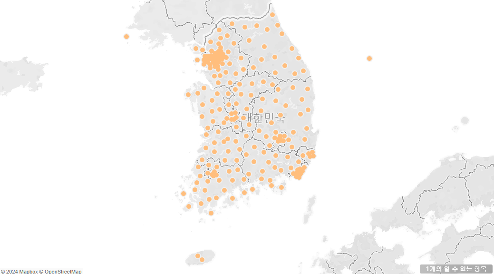
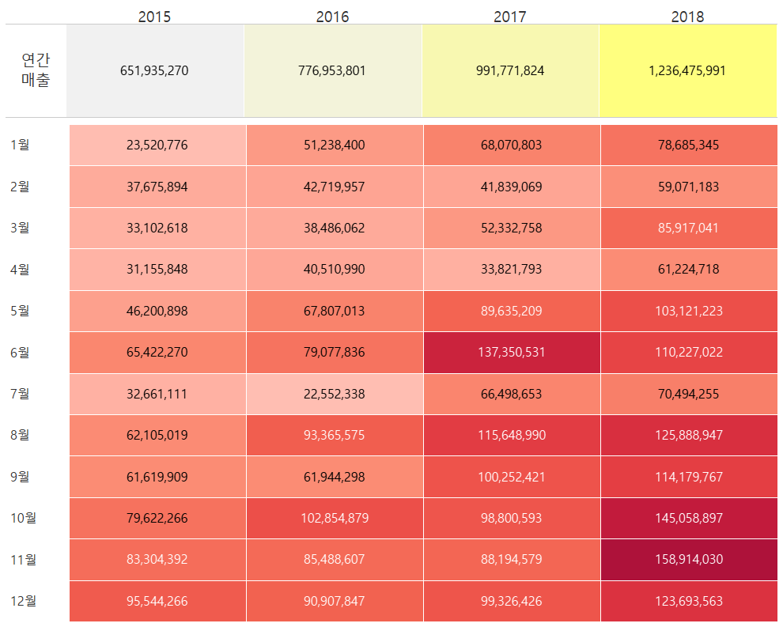

#1. 고객별 재구매 시기 데이터 분석 태블로 시각화

이 그래프는 고객별 두 번째 구매까지 걸린 날짜(구간 단위)와 고객들의 교차 카운트를 나타냅니다. 각 막대는 특정 구간에 해당하는 고객 수를 보여주며, 높이가 높을수록 그 구간에 해당하는 고객의 재구매 비율이 높은 것을 의미합니다. 
예를 들어, 그래프에서 100일 구간에 해당하는 막대는 고객들이 두 번째 구매까지 걸린 평균 기간이 100일임을 나타내며, 교차 카운트는 25명입니다.

#2. 고객 세그먼트별 연간 매출액 추이 그래프

#3. 고객 세그먼트별 연간 매출액 누적막대차트

#4. 연도별 매출액 영역차트

#5. 월별 매출액 라인 그래프 연도 비교

#6. 라운드형 막대 그래프를  다음과 같이 지역별 매출액 합계

#7. 평균라인이 있는 막대 그래프

#8. 계층 만들기1

#9. 계층 만들기2

#10. 지리적 역할 부여하기

#11. 채워진 맵 만들기

#12. 기호맵 만들기1

#13. 기호맵 만들기2

#14. 이중축 맵 만들기

#15. 수도권과 기타 지역 매출 영역 그래프

#16. 고객별 매출 순위 그래프

#17. 박스 플롯 그래프

#18. 파이 차트 그래프

#19. 도넛 차트 그래프

#20. 할인율 산포도 그래프

#21. 수익 트리맵 그래프

#22. 대시보드를 활용한 하이라이트 그래프 

